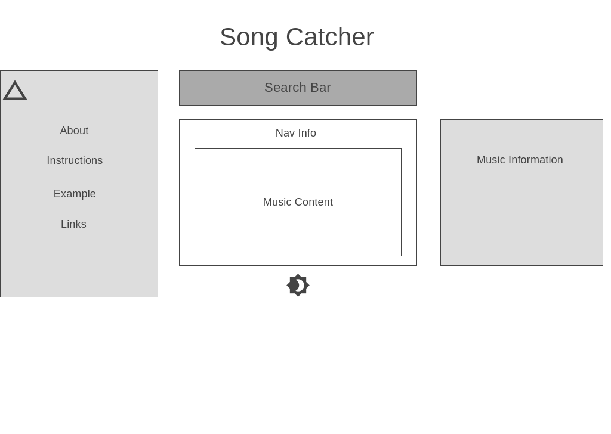

# Song-Catcher

Play [here!](https://pages.github.com/)

## Background

A JavaScript project that finds songs for you and showcases varying statistics of it, such as popularity over time and total listens. Find songs using the interactive searchbar and order them by title, artist, or year released. Be sure to look for your favorites and learn more about them!

## Functionality & MVPs

In Song Catcher, users will be able to:

- Search for given song in the provided searchbar
- Order songs by preference of title, artist, or year released 
- Select songs to provide lyrics to the song, popularity over time, and total listens from release
- Visualize popularity over time through a provided graph 
- Expand/shrink left sidebar
- Toggle between light and dark mode

In addition, this project will include:

- Instructions on how to use and what you can do 
- Everyone's favorite **README**

## Wireframes

## Technologies, Libraries, APIs

- [lyrics.ovh](https://lyricsovh.docs.apiary.io/#reference/0/lyrics-of-a-song/search)
- [Spotify API](https://developer.spotify.com/documentation/web-api/)
- [D3](https://d3js.org/)
- [Webpack](https://webpack.js.org/)
- [NPM](https://www.npmjs.com/)

## Implementation Timeline

### Day 1-2 Jan 1st-2nd:

Research using technologies, set up webpack, and get CSS/HTML working.

### Day 3 Jan 3rd:

Create working searchbar with lyrics.ovh.

### Day 4 Jan 4th:

Implement Spotify API that queries data based off returned songs.

### Day 5 Jan 5th:

Implement D3 with working graph that displays song history alongside total listens. 

### Day 6 Jan 6th:

Ensure working links and toggle features.

## Bonus

- User ability to delete songs 
- Save songs to local account 
